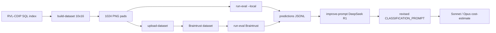

Replicate and improve the **Kimi K3 / 1024×1024 / 10-per-class** Braintrust
experiment inside this repo.

Project defaults (override via `.env`):

| Env | Default |
|-----|---------|
| `BRAINTRUST_PROJECT` | `DSHB_amfam_capstone_2026` |
| `BRAINTRUST_DATASET` | `fixed_size_sampled` |
| `BRAINTRUST_ORG` | _(empty — set if your key spans orgs)_ |
| `BRAINTRUST_API_KEY` | _(required for upload / live Eval)_ |
| `OPENROUTER_API_KEY` | _(required for live model calls)_ |

## Architecture



| Module | Role |
|--------|------|
| [`src/braintrust_eval/dataset.py`](../src/braintrust_eval/dataset.py) | Stratified test-split sample + pad to 1024² PNG |
| [`src/braintrust_eval/classifier.py`](../src/braintrust_eval/classifier.py) | `CLASSIFICATION_PROMPT`, OpenRouter vision call, reasoning capture |
| [`src/braintrust_eval/upload_dataset.py`](../src/braintrust_eval/upload_dataset.py) | Braintrust dataset + image attachments |
| [`src/braintrust_eval/eval_runner.py`](../src/braintrust_eval/eval_runner.py) | Local scoreboard + Braintrust `Eval` (`exact_match`) |
| [`src/braintrust_eval/prompt_improve.py`](../src/braintrust_eval/prompt_improve.py) | DeepSeek R1 prompt revision from errors |
| [`src/braintrust_eval/cost_estimate.py`](../src/braintrust_eval/cost_estimate.py) | Scale cost projections from observed token avgs |
| [`evaluation/prompts/rvl_classify_vision_bt.txt`](../evaluation/prompts/rvl_classify_vision_bt.txt) | Versioned prompt template |

OpenRouter client changes in
[`src/utils/llm_client.py`](../src/utils/llm_client.py):

- Capture `reasoning` / `reasoning_content` / `reasoning_details`
- Pass `extra_body.reasoning` (effort / exclude)
- Usage fields: cached prompt tokens + completion reasoning tokens
- `max_tokens` guard when reasoning consumes the whole budget (Kimi needs ≥500)

## Setup

```bash
pip install -e ".[dev,braintrust]"
python scripts/setup_env.py
# paste OPENROUTER_API_KEY + BRAINTRUST_API_KEY into .env

python -m src.braintrust_eval status
```

## Dataset

Live images (needs RVL SQL index + archive materialization):

```bash
python -m src.rvl_cdip build
python -m src.rvl_cdip download-images \
  --i-understand-large-download --confirm-writes-under-venv
python -m src.braintrust_eval build-dataset
# → data/braintrust/fixed_size_sampled/{images,samples.jsonl,manifest.json}
```

Wiring / CI without the 38 GB archive:

```bash
python -m src.braintrust_eval build-dataset --placeholder
```

## Upload + Eval

```bash
# Push attachments to Braintrust
python -m src.braintrust_eval upload-dataset

# Local dry-run (no API)
python -m src.braintrust_eval run-eval --local --dry-run

# Live Kimi K3 with visible reasoning (max_tokens=500, temperature=0.1)
python -m src.braintrust_eval run-eval --model moonshotai/kimi-k3

# Local live loop writing predictions JSONL (no Braintrust experiment)
python -m src.braintrust_eval run-eval --local --model moonshotai/kimi-k3
```

## Prompt improvement (DeepSeek R1)

DeepSeek R1 is **text-only** — use it on misclassification traces (especially
rows where Kimi returned `reasoning`), not as the vision classifier:

```bash
python -m src.braintrust_eval improve-prompt \
  --predictions data/braintrust/runs/predictions_moonshotai_kimi-k3.jsonl \
  --model deepseek/deepseek-r1
```

Copy the improved template into
`evaluation/prompts/rvl_classify_vision_bt.txt` (or pass via code) and re-run.

## Cost projections

Uses observed Kimi K3 averages from the 160-image run (prompt ≈1769,
completion ≈172, cached ≈873) and rates in
[`evaluation/pricing.yaml`](../evaluation/pricing.yaml)
(`braintrust_vision_models`):

```bash
python -m src.braintrust_eval cost-estimate
python -m src.braintrust_eval cost-estimate \
  --model moonshotai/kimi-k3 \
  --model anthropic/claude-sonnet-4.5 \
  --model anthropic/claude-opus-4.5 \
  --counts 160 800 25000 320000
```

After a live Sonnet/Opus run, feed that run's token averages into
`project_costs(...)` for tighter flagship estimates.

## Settings checklist (match the original experiment)

| Knob | Value |
|------|------:|
| Images | 160 (10 × 16 classes) |
| Image size | 1024×1024 padded PNG |
| Prompt | `CLASSIFICATION_PROMPT` / `rvl_classify_vision_bt` |
| `max_tokens` | **500** (20 is too low — reasoning eats the budget) |
| `temperature` | 0.1 |
| Scorer | `exact_match` on normalized RVL label |
| Primary vision model | `moonshotai/kimi-k3` |
| Prompt analyst | `deepseek/deepseek-r1` |
